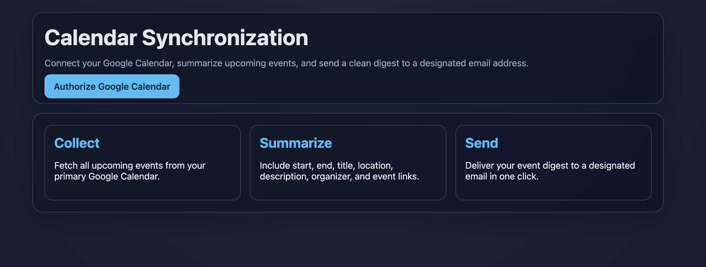
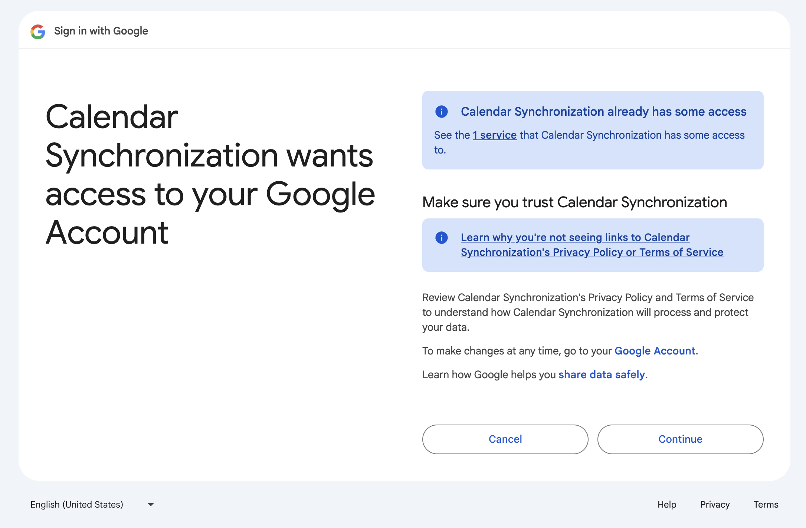
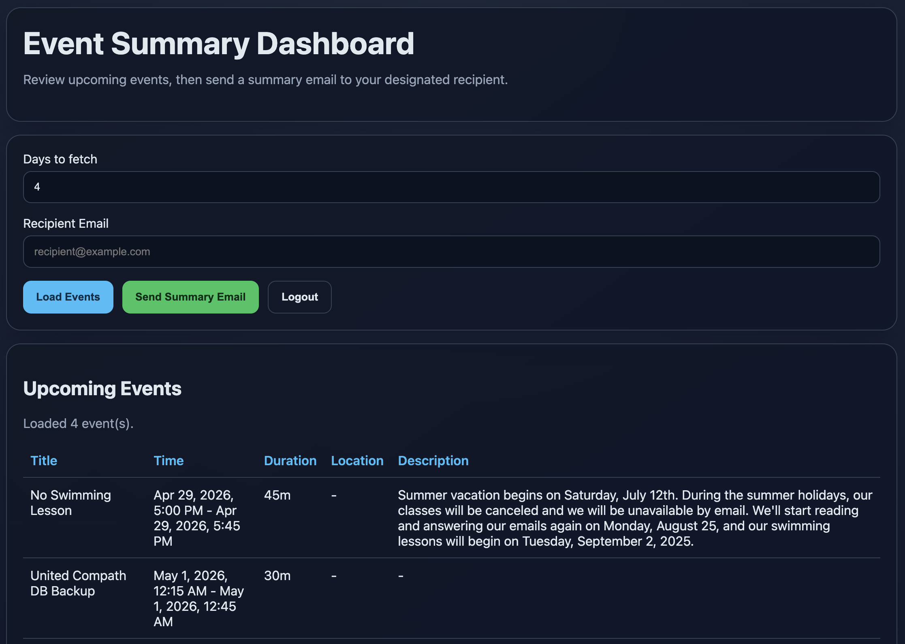
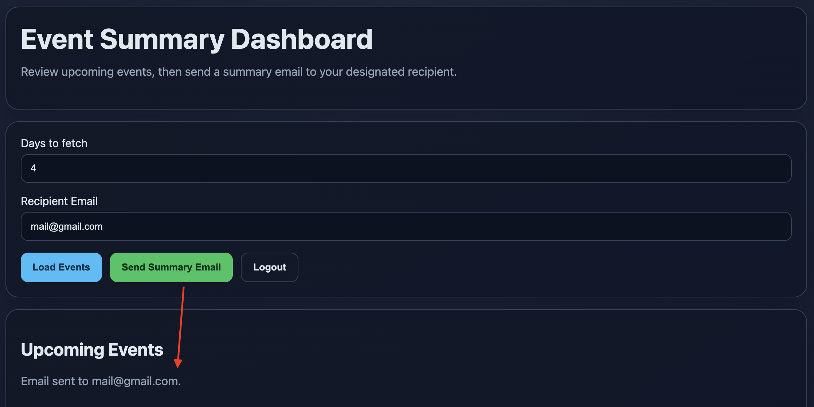

# Calendar Synchronization (Node.js)

Calendar Synchronization is a Node.js web app that connects to Google Calendar, fetches upcoming events, generates readable summaries, and emails the digest to a chosen recipient.

## Features

- Google OAuth2 login flow for Calendar access
- Fetch events from the primary Google Calendar
- Event list sorted ascending by start date/time
- Clean dashboard with columns: `Title`, `Time`, `Duration`, `Location`, `Description`
- Email digest with the same summarized event fields
- Responsive UI with modern HTML/CSS

## Screenshots

### Home



### Authorization



### Dashboard



### Send Email



> Note: These screenshots are loaded from the `screenshoot/` directory.

## Tech Stack

- `Node.js` + `Express`
- `googleapis` for Google Calendar OAuth/API
- `express-session` for session handling
- `nodemailer` for SMTP email delivery
- Vanilla HTML/CSS/JS frontend

## Project Structure

- `src/server.js` - Express app and API routes
- `src/config/env.js` - environment loading and validation
- `src/services/googleCalendar.js` - OAuth URL, token exchange, event fetch/normalize
- `src/services/emailService.js` - SMTP mail transport/send logic
- `src/utils/eventFormatter.js` - event formatting for plain text and HTML summaries
- `public/index.html` - landing and Google authorization entry
- `public/dashboard.html` - event dashboard UI
- `public/app.js` - dashboard API integration and rendering
- `tests/eventFormatter.test.js` - summary formatting tests
- `screenshoot/` - README screenshot assets

## Prerequisites

- Node.js `>= 20`
- A Google Cloud project with Calendar API enabled
- OAuth 2.0 Client ID (Web application)
- SMTP credentials for sending email

## Quick Start

```bash
npm install
cp .env.example .env
npm test
npm run dev
```

Open:

- `http://localhost:3000`

## Environment Variables

Configure these in `.env`:

- `PORT` - app port (default `3000`)
- `SESSION_SECRET` - session encryption secret
- `GOOGLE_CLIENT_ID` - Google OAuth client ID
- `GOOGLE_CLIENT_SECRET` - Google OAuth client secret
- `GOOGLE_REDIRECT_URI` - must be `http://localhost:3000/auth/google/callback` for local dev
- `DEFAULT_RECIPIENT_EMAIL` - fallback email recipient for summaries
- `SMTP_HOST` - SMTP server host
- `SMTP_PORT` - SMTP port (`587` for STARTTLS, `465` for SSL)
- `SMTP_SECURE` - `true` for SSL (`465`), `false` for STARTTLS (`587`)
- `SMTP_USER` - SMTP username
- `SMTP_PASS` - SMTP password/app password
- `MAIL_FROM` - sender display/address

## Google Cloud Console Setup

1. Enable **Google Calendar API**.
2. Configure **OAuth consent screen**.
3. Set user type to `External` for personal Gmail testing.
4. Add your account under **Test users** (if app is in Testing mode).
5. Create **OAuth 2.0 Client ID** (Web Application).
6. Add authorized redirect URI exactly as:
   - `http://localhost:3000/auth/google/callback`

## API Endpoints

- `GET /auth/google` - starts Google OAuth flow
- `GET /auth/google/callback` - OAuth callback endpoint
- `GET /api/auth/status` - returns authentication status
- `GET /api/events?days=7` - fetches upcoming events
- `POST /api/send-summary` - sends email summary (`{ days, recipient }`)
- `POST /api/auth/logout` - logs out and clears session

## Testing

```bash
npm test
```

## Build and Run

```bash
npm run build
npm start
```

## Troubleshooting

- **Error `Missing script: build`**: resolved in this project (`npm run build` is available).
- **Google OAuth `403 access_denied`**: add your login email to OAuth consent screen test users.
- **Unverified app warning**: expected in testing mode; use test users or submit verification.
- **SMTP fails on port `465`**: set `SMTP_SECURE=true`.

## Security Notes

- Do not commit `.env` or credentials.
- Rotate secrets immediately if exposed.
- Current session storage is in-memory; use Redis/DB-backed session store for production.
- Use HTTPS in production.

## License

This project is licensed under the MIT License. See [LICENSE](LICENSE) file for details.

## Contact

**Developer:** Parvej Choudhury  
**Email:** parvej35@gmail.com

For questions, bug reports, or feature requests, please reach out via email.